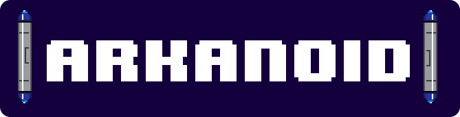
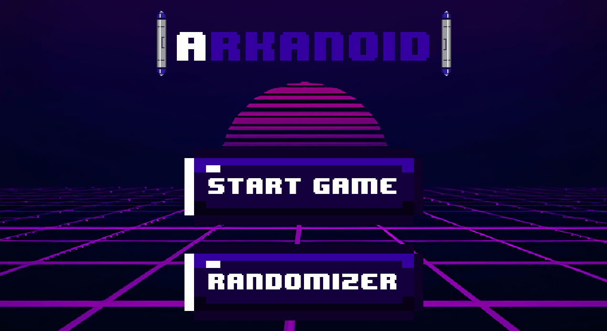
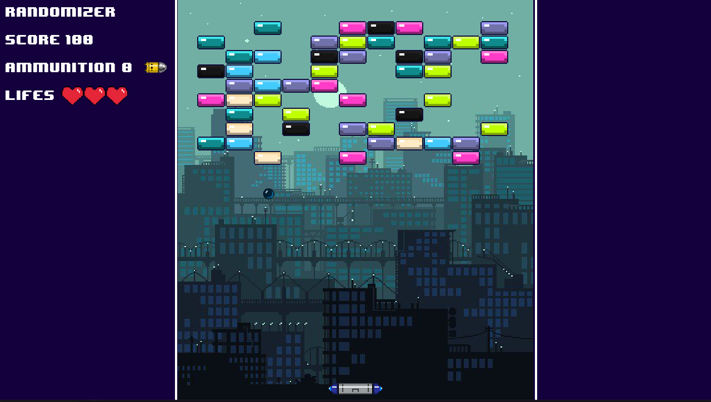
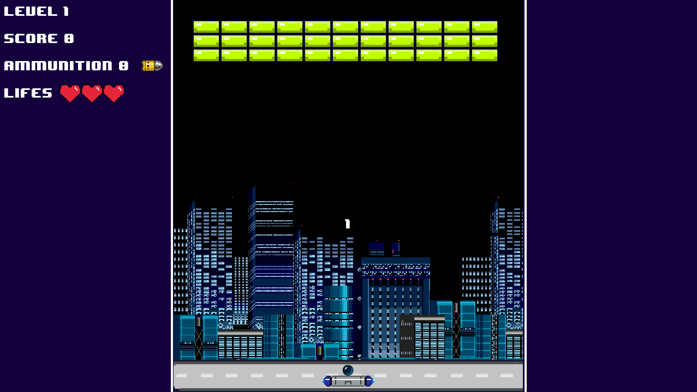
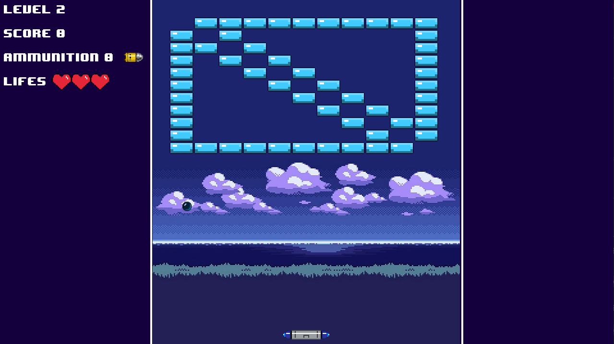
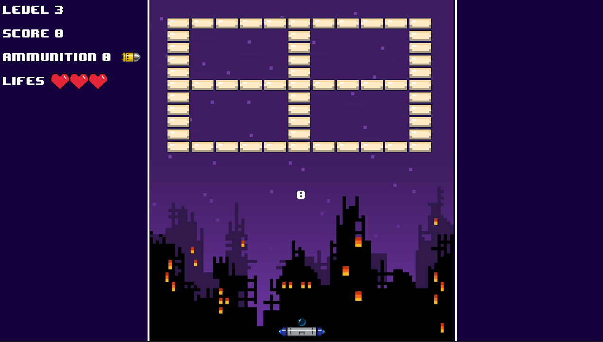
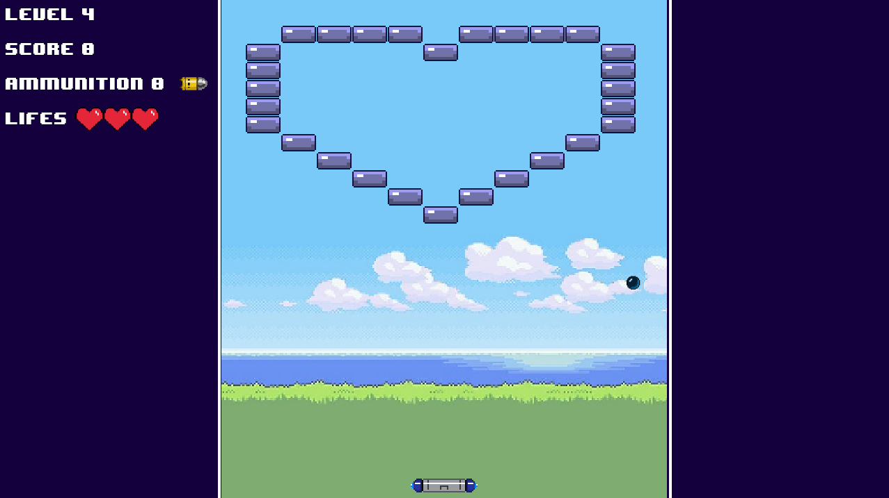
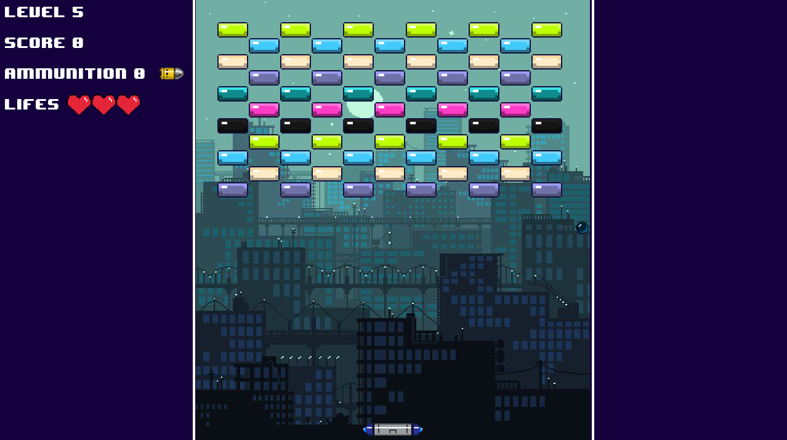
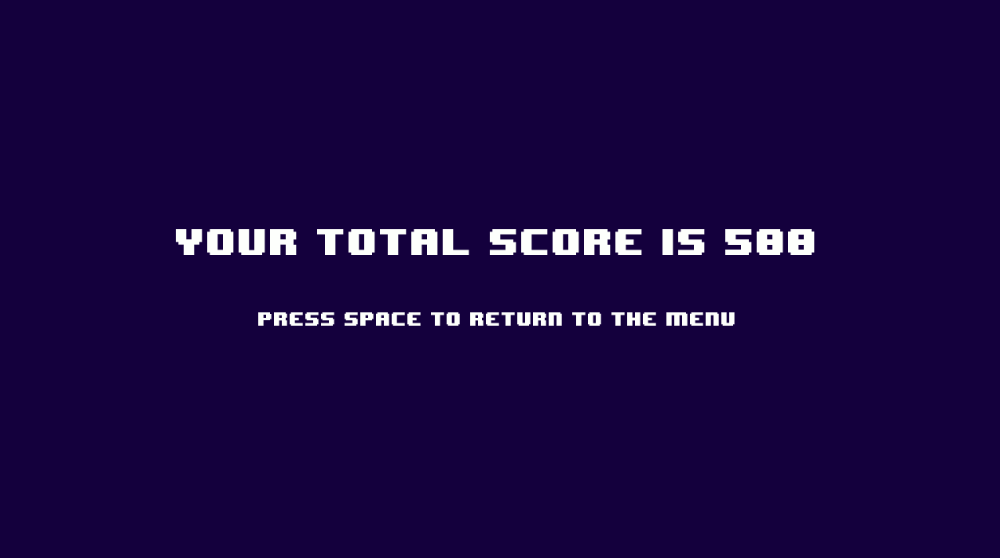

<p align="center">
  

  
  
  <a href="https://github.com/grochavieira/py-arkanoid/commits/master">
    
  </a>
    
   
  
 
</p>
<h1 align="center">
    
</h1>

<h4 align="center"> 
	🚧  Aplicação finalizada! 🚧
</h4>

## 🏁 Tópicos

<p>
 👉<a href="#-sobre-o-projeto" style="text-decoration: none; "> Sobre</a> <br/>
👉<a href="#-funcionalidades" style="text-decoration: none; "> Funcionalidades</a> <br/>
👉<a href="#-layout" style="text-decoration: none"> Layout</a> <br/>
👉<a href="#-como-executar-o-projeto" style="text-decoration: none"> Como executar</a> <br/>
👉<a href="#-tecnologias" style="text-decoration: none"> Tecnologias</a> <br/>
👉<a href="#-autor" style="text-decoration: none"> Autor</a> <br/>
👉<a href="#user-content--licença" style="text-decoration: none"> Licença</a>

</p>

## 💻 Sobre o projeto

Jogo do arkanoid feito em python para a matéria de Desenvolvimento de Jogos do 7° Semestre do curso de Ciência da Computação.

---

<a name="-funcionalidades"></a>

## ⚙️ Funcionalidades

- [x] Menu para escolher modo de jogo;
- [x] Animação com sprites;
- [x] Modo Normal;
  - [x] 5 fases;
- [x] Modo Randomizer;
  - [x] Cada fase é gerada aleatóriamente.
- [x] Sistema de vidas (3 no inicio e podem chegar até 5, se zerar o jogo acaba).
- [x] Sistema de poderes:
  - [x] Aumentar o tamanho da raquete;
  - [x] Diminuir o tamanho da raquete;
  - [x] +1 Vida;
  - [x] - Velocidade (até o dobro da velocidade da raquete);
  - [x] Munição para lasers (3 munições - 2 tiros para cada uma).
- [x] Sistema de pontuação:
  - [x] 100 pontos por cada acerto nos bloquinhos;
  - [x] Ao destruir um bloquinho você ganha 100 + 100 \* vida do bloquinho

---

## 🎨 Layout

### Tela Inicial

<div align="center">
    
</div>

### Randomizer

<div align="center">
    
</div>

### Level 1

<div align="center">
    
</div>

### Level 2

<div align="center">
    
</div>

### Level 3

<div align="center">
    
</div>

### Level 4

<div align="center">
    
</div>

### Level 5

<div align="center">
    
</div>

### Lost Screen

<div align="center">
    
</div>

---

## 🚀 Como executar o projeto

### Pré-requisitos

Antes de começar, você vai precisar ter instalado em sua máquina a última versão do python e também
é necessário instalar o pygame.
Além disto é bom ter um editor para trabalhar com o código como [VSCode](https://code.visualstudio.com/)

#### 🧭 Rodando o jogo

```bash

# Clone este repositório
$ git clone https://github.com/grochavieira/py-arkanoid.git

# Acesse a pasta do projeto no seu terminal/cmd
$ cd py-arkanoid

# Acesse a pasta game
$ cd game

# Execute a aplicação
$ python main.py


```

---

## 🛠 Tecnologias

As seguintes ferramentas foram usadas na construção do projeto:

**Jogo** ([Python](https://www.python.org/) + [PyGame](https://www.pygame.org/news))

#### **Utilitários**

- Editor: **[Visual Studio Code](https://code.visualstudio.com/)**
- Fontes: **[Rajdhani](https://fonts.google.com/specimen/Rajdhani)**, **[Inter](https://fonts.google.com/specimen/Inter)**
- Criação dos Sprites: **[Piskel](https://www.piskelapp.com/)**

---

<a name="-autor"></a>

## 🦸‍♂️ **Autores**

<!-- <table align="center" width="100%">

  <tr>
      <td align="center"><a href="https://rocketseat.com.br"><br /><sub><b>Guilherme Rocha</b></sub></a><br /><a href="https://rocketseat.com.br/" title="Rocketseat">👨‍🚀</a></td>
      <td align="center"><a href="https://rocketseat.com.br"><br /><sub><b>🔥 Victor Masumoto 🔥</b></sub></a><br /><a href="https://rocketseat.com.br/" title="Rocketseat">👨‍🚀</a></td>
  </tr>

</table> -->

<table align="center" width="100%">
  <tr align="center">
    <td width="50%">
      
      <br />
      <sub><strong>🌟 Guilherme Rocha Vieira 🌟</strong></sub>
      </p>
      <p align="center">
      [](https://www.linkedin.com/in/grochavieira/)
      </p>
    </td>
    <td width="50%">
      
      <br />
      <sub><strong>🔥 Victor Masumoto 🔥</strong></sub>
    </td>

  </tr>

</table>

---

## 📝 Licença

Este projeto esta sobe a licença [MIT](./LICENSE).

Feito com :satisfied: por Guilherme Rocha Vieira [Entre em contato!](https://www.linkedin.com/in/grochavieira/) 👋🏽 <br>
<br> por Victor Masumoto [Veja o Repositório](https://github.com/victor-m302)👈

---
